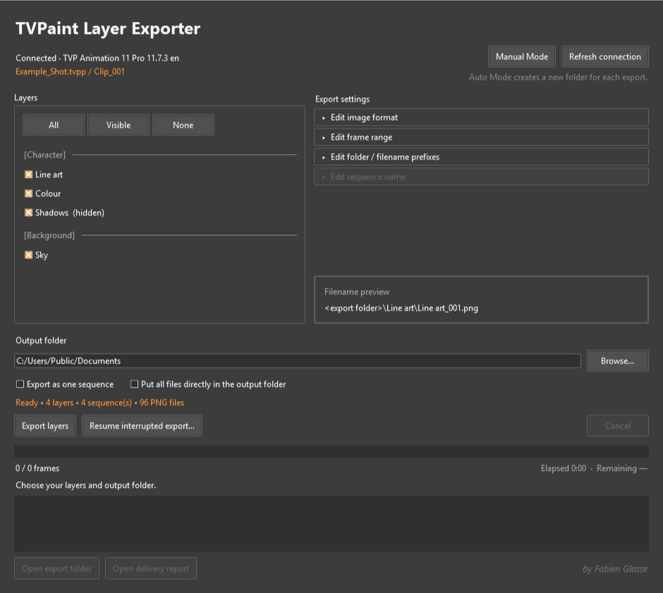

# TVPaint Layer Exporter

Export the layers of a TVPaint clip as image sequences, with customizable export and folder options. With delivery reports that an animator can hand to compositing.

TVPaint Layer Exporter will lists the current clip's layers, lets you choose settings like frame range and image format, and will automatically activate/inactivate layers to export images sequences, before restoring your file to its original state. Auto Mode makes a new dated folder for each export. Manual Mode keeps one folder for a series of exports and can combine selected layers into one sequence for more personal workflows. Exports can be interrupted and resumed. TVPaint must be running with the scene open for the exporter and bridge to work.

The TVPaint connection uses [BRUNCH Studio's tvpaint-rpc](https://github.com/brunchstudio/tvpaint-rpc). Their work makes it possible for the exporter to read the current clip and send export commands to TVPaint. The installer downloads the matching connection component from their project.

## Get started

Download one of the two packages from [Releases](https://github.com/FabienGlasse/TVPaint_Layer_Exporter/releases):

| Package | Start with |
| --- | --- |
| Guided CMD installer | Extract the ZIP, then open `Install.bat`. It asks before each setup stage. |
| Conventional installer | Extract the ZIP, then open `TVPaintLayerExporterSetup.exe`. Leave the final configuration option selected. |

Close TVPaint before installation. Setup needs an internet connection and Windows administrator approval to install the TVPaint connection component. When setup finishes, open TVPaint and use the **TVPaint Layer Exporter** desktop shortcut. The [User Guide](docs/assets/User%20Guide.html) walks through the first export, settings, Manual Mode, delivery and uninstalling without assuming any knowledge of Python.

The installer was trialled on Windows 11 with TVPaint 11.7.3 and 12.1.0.

## In the export folder

Each selected layer normally gets its own sequence folder. You can also combine checked layers, put all images at the export folder root, add separate folder and filename prefixes, or include the TVPaint background. `Delivery Report.txt` records the full source layer for compositing use and adds the details of each export. A hidden `export_manifest.json` keeps the latest export's resume information.

## Source and build

The exporter source is in [exporter](exporter); the guided and conventional installers are in [packaging](packaging). See [Building and testing](BUILDING.md) for the test commands and package build. The source checkout is for development; freelancers should use a release package.

Created by Fabien Glasse. See [copyright and use](COPYRIGHT.md) and [third-party components](THIRD_PARTY.md).
